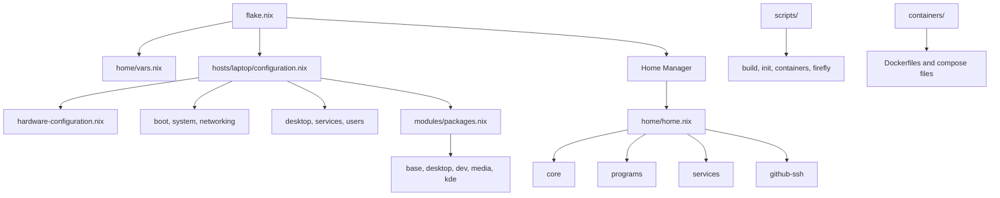

# nix-config — NixOS + KDE Plasma 6 (Flake) + Home Manager

This repository contains a complete **NixOS** configuration based on flakes, with Home Manager integration, KDE Plasma 6 desktop, NetworkManager, PipeWire, Docker, helper scripts for containers, and periodic KeePass database sync via rclone (Google Drive).

---

## Overview

- Modular structure with separation between host, home, packages, and scripts
- Host defined: `laptop` (`hosts/laptop/`)
- User managed via `home/vars.nix`
- Desktop: SDDM + Plasma 6 (Wayland enabled)
- Development tools: VSCode, Git, Python, etc.
- Containers: Docker in NixOS and helper scripts in `scripts/`
- KeePass sync: systemd user service/timer with rclone

---

## Repository Structure

```txt
nix-config
├── home
│   ├── home.nix
│   ├── vars.example.nix
│   └── modules
├── hosts
│   └── laptop
│       └── configuration.nix
├── modules
│   ├── boot
│   ├── desktop
│   ├── networking
│   ├── packages
│   ├── services
│   ├── system
│   └── users
├── scripts
├── flake.lock
├── flake.nix
└── .gitignore
```

## Configuration Diagram



This diagram shows the main flow:

- `flake.nix` loads local variables, the NixOS host, and the Home Manager user config.
- `hosts/laptop/configuration.nix` assembles the machine-specific NixOS modules.
- `modules/packages.nix` works as an aggregator for package groups split by domain.
- `home/home.nix` works as an aggregator for user modules, programs, and user services.
- `scripts/` contains helper tooling, while `containers/` keeps container artifacts only.

---

## Prerequisites

1. NixOS system with flakes enabled

Make sure the following features are enabled:

```nix
nix-command
flakes
```

(This repository already enables them in `modules/system/nix.nix`.)

2. Git and sudo access

3. This repository cloned locally:

```bash
git clone https: ...
cd nix-config
```

---

## Initial Setup (First Time)

### 1. Create your local variables file

Copy the example file:

```bash
cp home/vars.example.nix home/vars.nix
```

Edit it with your user information:

```bash
nano home/vars.nix
```

---

### 2. Run the build helper script (Recommended)

Before running `nixos-rebuild` directly, use the provided helper script:

```bash
./scripts/nix-build-laptop.sh
```

This script will:

- Check if `hardware-configuration.nix` exists
- Generate `hardware-configuration.nix` inside the repo if missing
- Provide a safe menu for rebuilding
- Prevent evaluation errors

This is the recommended entry point for new systems.

---

## Usage

### Using the Interactive Build Script (Recommended)

```bash
./scripts/nix-build-laptop.sh
```

Available options:

- Check/generate hardware configuration
- Build system
- Switch configuration
- Update flakes
- Boot configuration

---

### Manual Rebuild

If `hardware-configuration.nix` is already present:

```bash
sudo nixos-rebuild switch --flake .#laptop --impure
```

Update inputs and rebuild:

```bash
nix flake update
sudo nixos-rebuild switch --flake .#laptop --impure
```

---

## SSH / GitHub Setup

This configuration provides helper commands:

```bash
ghkey
ghkey-rotate
```

They create and manage an SSH key for GitHub authentication.

After generating a key, add it to:

GitHub → Settings → SSH and GPG keys

---

## KeePass Sync Logs

Check synchronization logs with:

```bash
journalctl --user -u keepass-sync.service -e
```

---

## Portability Notes

This repository is designed to be portable:

- `home/vars.nix` is ignored by git
- `hardware-configuration.nix` is generated per machine
- User-specific data is not committed
- Fallback to `vars.example.nix` is supported

Each user must provide:

- Their own `vars.nix`
- Their own hardware configuration

---

## Recommended Workflow

```bash
git clone <repo>
cd nix-config
cp home/vars.example.nix home/vars.nix
nano home/vars.nix
./scripts/nix-build-laptop.sh
```

---

## License

Personal configuration repository.
Feel free to fork and adapt.
